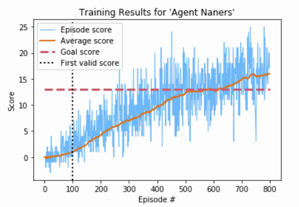

# Banana-DQN Report: Agent Naners

To solve this environment a Deep Q-learning Network (DQN) was used for the agent with very few modifications. Briefly, the DQN agent architecture consists of two neural networks to learn from experience, and a replay buffer to store experiences that are sampled from during learning.

## Files

The following files are used for this implementation:

| Filename | Purpose |
| --- | --- |
| ```dqn_model.py``` | Contains the QNetwork neural net model |
| ```dqn_agent.py``` | Agent local and target networks and experience buffer |
| ```trainers.py``` | Training function and support for DQN agents |
| ```demos.py``` | Demos using trained or random agents |
| ```agent_utils.py``` | Utility functions including saving models and plotting |

## DQN

### Experience Replay Buffer

Experiences of ```(state, action, reward, next_state, done)``` tuples are observed by the agent every time step and stored in an Experience Replay Buffer. The replay buffer uses the ```buffer_size``` hyperparameter to determine how many experiences it should keep before discarding or 'forgetting' the oldest. During learning, ```batch_size``` samples are selected uniformly at random and used for the update.

### Weight Copying with Soft Update

When copying the weights of the local network to the target network every ```copy_every``` time steps, a soft update method  was used instead of the original full copy method. The soft update introduces a new hyperparameter ```tau``` that controls the mixture of target and local network weights used to update the target network, helping to stabilize training.

## Network Architecture

Rather than using convolutional neural networks for processing raw pixel data as described in the DQN paper, multi-layer perceptron networks were sufficient enough for the agent to learn the lower dimensional state space in this environment.

The neural network used for the agent uses a linear input layer the same size as the state space, ```37```. The implementation uses a RLeU activation before the hidden layers.

The number and sizes of the hidden layers is configured with a list of sizes provided to the agent at creation, ```layers```.  Each of the linear hidden layers is fully connected and uses a RLeU activation.

The final output layer matches the size of the action space, ```4```. Once again it is a fully connected linear layer, but unlike the rest of the model doesn't use an activation. Returning the logits of each action allows the agent to choose the final action taken based on these values.

## Hyperparameters

The following table lists the hyperparameters available for this agent and training algorithm.

| Hyperparameter | Default | Description |
| ---- | --- | --- |
| name | 'default_dqn' | Name of agent, not impact on training. Used for save directory. |
| layers | [64, 64] | List of n layer sizes used for the local and target networks. |
| buffer_size | 100000 | Length of Experience Replay Buffer. |
| batch_size | 64 | Batch size for sampling the Experience Replay Buffer. |
| update_every | 4 | How many time steps between agent updates. |
| copy_every | 4 | How many time steps between copying local weights to target. |
| learning_rate | 0.0005 | Learning rate of the local network. |
| gamma | 0.99 | Discount factor for future rewards. |
| tau | 0.001 | Interpolation factor for soft update. Full target copy = 0 |
| epsilon_start | 1.0 | Epsilon starting value. |
| epsilon_end | 0.001 | Minimum value epsilon can take during training. |
| epsilon_decay | 0.995 | Epsilon decay factor, applied every episode. |

## Results

The agent trained to solved this environment, ```Agent Naners```, used the following network:

* input layer of size ```37``` with ReLU activation
* hidden layer of size ```32``` with ReLU activation
* hidden layer of size ```32``` with ReLU activation
* output layer of size ```4``` without any activation (logits)

The parameters used by ```Agent Naners``` were mostly the default values, with a smaller network and increased time step between weight copying:

| Hyperparameter | Value |
| --- | --- |
| name | 'Agent Naners' |
| layers | [32, 32] |
| buffer_size | 100000 |
| batch_size | 64 |
| update_every | 4 |
| copy_every | 8 |
| learning_rate | 0.0005 |
| gamma | 0.99 |
| tau | 0.001 |
| epsilon_start | 1.0 |
| epsilon_end | 0.001 |
| epsilon_decay | 0.995 |

```Agent Naners``` was able to solve the environment in ```581``` episodes. Training on a consumer-grade GPU took around 20 minutes.



*Plot of agent training, with the full range of score and a smoothed average score over 100 episodes.*

While the range of sequential individual episodes scores is large, there is a clear overall trend demonstrating the agents ability to learn the environment.

## Ideas for Future Work

The DQN agent used by this project provides a solid foundation with many well established methods for improvement.

* Double DQN is regarded as the simplest change that can help avoid over-fitting.
* Prioritized Experience Replay improves sample efficiency by weighting experiences based on their impact on training. This can lead to improved training time, and is used in several agent architectures.
* Deep Mind's RAINBOW combines many of the common improvements to DQN, and outperforms any single improvement alone.

## References

* Volodymyr, et al. “Playing Atari with Deep Reinforcement Learning.” ArXiv.org, 19 Dec. 2013, arxiv.org/abs/1312.5602.
* Hasselt, van, et al. “Deep Reinforcement Learning with Double Q-Learning.” ArXiv.org, 8 Dec. 2015, arxiv.org/abs/1509.06461.
* Schaul, et al. “Prioritized Experience Replay.” ArXiv.org, 25 Feb. 2016, arxiv.org/abs/1511.05952.
* Hessel, et al. “Rainbow: Combining Improvements in Deep Reinforcement Learning.” ArXiv.org, 6 Oct. 2017, arxiv.org/abs/1710.02298.
* Udacity Deep Reinforcement Learning Nanodegree Program, https://www.udacity.com/course/deep-reinforcement-learning-nanodegree--nd893.

## Additional Material

### Saved Agent Structure

Agents are saved during training to the ```saved_agents/[agent_name]/``` directory, where ```[agent_name]``` is the agent name. The created agent directory contains the files outlined below, saving properties of the agent and results of training.

| Filename(s) | Description |
| --- | ---- |
| local_weights.pyt | Final weights for the local q-network |
| target_weights.pyt | Final weights for the target q-network |
| params.json | Hyperparameters used for this agent, saved as a json dictionary |
| scores.npy | Scores the agent earned during training, in the numpy .npy format |
| /.checkpoints/[ep_#]-local_weights.pyt | Checkpoints for local q-network weights |
| /.checkpoints/[ep_#]-target_weights.pyt | Checkpoints for target q-network weights |
| /.checkpoints/[ep_#]-scores.npy | Checkpoints for training scores |
